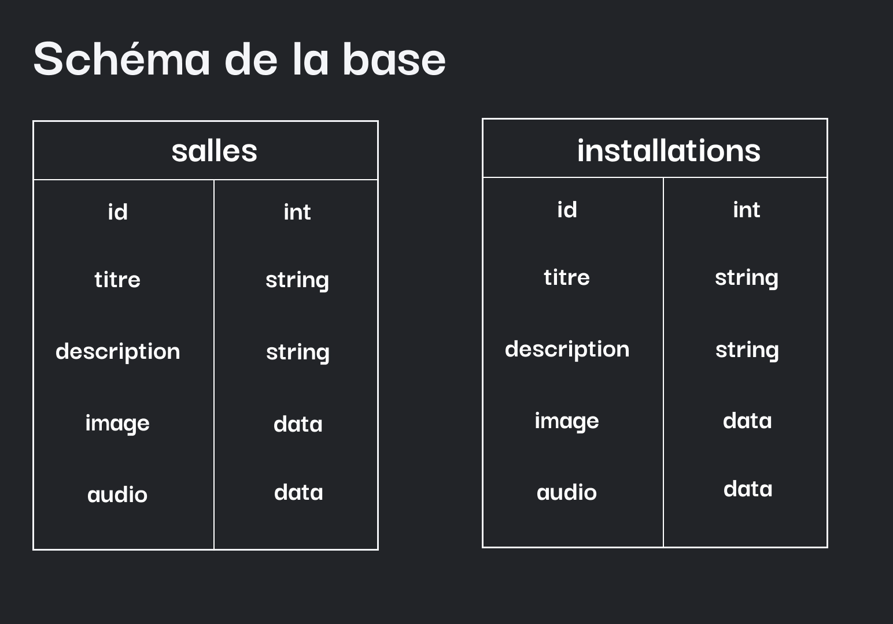

# Nom de l'Application

## Présentation du Projet

Le Projet est une application mobile qui porte le nom "UwU" qui est la version mobile du musée de l'illusion sur paris. Elle offre une visite guidée interactive, présentant chaque salle et installation du musée. L'utilisateur peut accéder à des informations détaillées, des images et des commentaires audio pour chaque pièce exposée.

## Stack Technologique

L'application est développée en utilisant Ionic Vue, un framework puissant pour la création d'interfaces utilisateur mobiles et interactives. Pour la gestion des données, nous avons opté pour Airtable, une plateforme de base de données en tant que service, qui permet une manipulation facile des données et une intégration fluide avec notre application.

- **Frontend :** Ionic Vue
- **Base de Données :** Airtable

## Tables BDD

## Post Mortem

### Commentaires sur le Projet

Le Projet était cool , on a eu le choix des technologies et ca c'était pas mal du tout , on a pu apprendre de nouvelles choses avec ionic vue et l'implementation de airtable

### Difficultés Rencontrées

Pour les difficultés rencontrées , on a eu des soucis avec la prise en main de ionic vue , mais on a pu s'en sortir en regardant la documentation t en faisant des recherches sur internet

### Limitations et Axes d'Amélioration

Au niveau des axes d'amélioration, on aurait voulu ajouter une fonctionnalité de scan de qr code pour accéder aux informations des salles directement depuis l'application.
